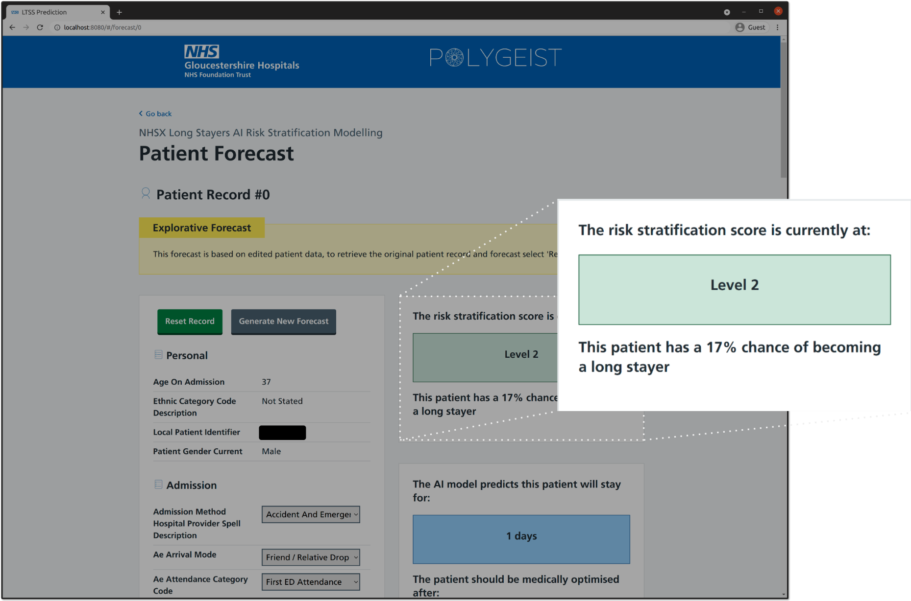

# NHS AI Lab Skunkworks project: Long Stayer Risk Stratification

> A pilot project for the NHS AI (Artificial Intelligence)  Lab Skunkworks team, Long Stayer Risk Stratification uses historical data from Gloucestershire Hospitals NHS Foundation Trust to predict how long a patient will stay in hospital upon admission.

As the successful candidate from the AI Skunkworks problem-sourcing programme, Long Stayer Risk Stratification was first picked as a pilot project for the AI Skunkworks team in April 2021.

## Background
Hospital long stayers, those with a length of stay (LoS) of 21 days or longer, have significantly worse medical and 
social outcomes than other patients.  Long-stayers are often medically optimised (fit for discharge) many days before 
their actual discharge.  Moreover, there are a complex mixture of medical, cultural and socioeconomic factors which 
contribute to the causes of unnecessary long stays.  

This repository contains a proof-of-concept demonstrator, developed as part of a research project - a collaboration between [Polygeist](https://polygei.st/), [Gloucestershire Hospitals NHS Foundation Trust](https://www.gloshospitals.nhs.uk/), [NHSX](https://www.nhsx.nhs.uk/), and 
the Home Office’s [Accelerated Capability Environment (ACE)](https://www.gov.uk/government/groups/accelerated-capability-environment-ace). The project aimed to achieve two core objectives:  
firstly, to determine if an experimental artificial intelligence (AI) approach to predicting hospital long-stayers 
was possible; secondly, if so, to produce a proof-of-concept (PoC) risk stratification tool.

## Stratification Tool

The tool displays the LTSS for a patient record, between Level 1 and 5; with 5 being the most severe risk of the patient 
becoming a long stayer.  The tool allows exploration of various factors, and enables the user to edit those entries to produce
refined or hypothetical estimates of the patient's risk.

The tool has shown good risk stratification for real data, with Level 1 consisted of 99% short stayers, and minor 
cases, with less than 1% of long-stayers being classified as very low risk.  Moreover, 66% of all long-stayers were
classified as Risk Category 4 and 5, with proportions steadily increasing through the categories. Risk Category 5 also 
stratified those patients with long and serious hospital stays under the long-stay threshold (serious and lengthy stays).

## Documentation:

| Docs | Description |
| ---- | ----------- |
| [REST API](docs/rest_api.md) | API Endpoint descriptions and usage examples |
| [LTSS Flask App API](docs/ltss_package_api.md) | Package documentation for the `ltss` Python package and incorporated submodules |
| [Deployment Instructions](docs/build_and_deploy.md) | Build and run instruction for development or production deployments |
| [WebUI Overview](webui/README.md) | Description of UI components and application structure |
| [Configuration Files](config/README.md) | Overview of provided configuration files |
| [Production Build Configuration Files](deploy/README.md) | Overview of the configuration files provided for production build Docker containers |
| [Training](training/README.md) | Description of the training process for the models used in the LTSS API |

## NHS AI Lab Skunkworks
The project is supported by the NHS AI Lab Skunkworks, which exists within the NHS AI Lab to support the health and care community to rapidly progress ideas from the conceptual stage to a proof of concept.

Find out more about the [NHS AI Lab Skunkworks](https://www.nhsx.nhs.uk/ai-lab/ai-lab-programmes/skunkworks/).
Join our [Virtual Hub](https://future.nhs.uk/connect.ti/system/text/register) to hear more about future problem-sourcing event opportunities.
Get in touch with the Skunkworks team at [aiskunkworks@nhsx.nhs.uk](aiskunkworks@nhsx.nhs.uk).
